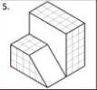

# Isometric figure in Python with Pygame

This program draws the next isometric figure on the screen.

- We are using the Pygame library.
- Install Pygame library: `pip install pygame`
- Run the main file to start program `python main.py`
- Key up increases the scaling of the figure 0.1, each time it is pressed
- Key down decreases the scaling of the figure 0.1, each time it is pressed
- Key right, rotates right the figure 1 degree, each time it is pressed
- Key left, rotates left the figure 1 degree, each time it is pressed

DEVELOPED BY:
- Carlos Daniel Londoño Avila
- Juan Esteban Montoya Molina
- Sebastián Velásquez Múnera

EMAILS:
- carlosdaniel.londono@utp.edu.co
- juanesteban.montoya@utp.edu.co
- sebastian.velasquez1@utp.edu.co

FOR COMPUTER GRAPICH CLASS, UNIVERSIDAD TECNOLÓGICA DE PEREIRA.
